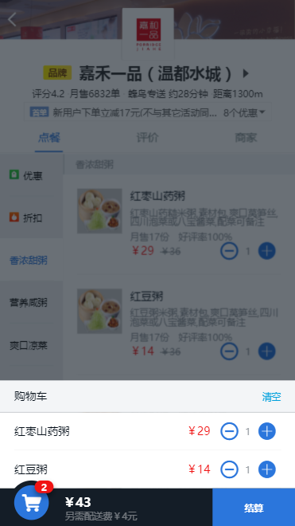
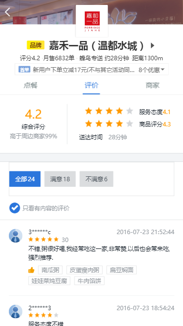
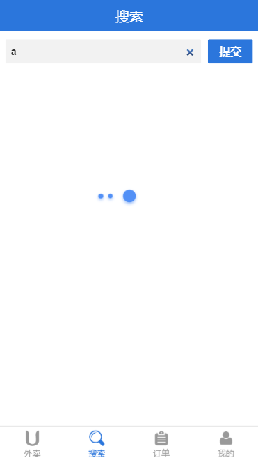
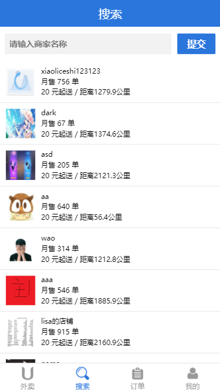
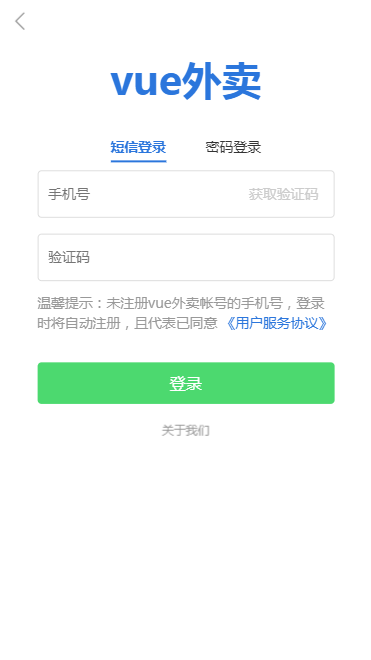
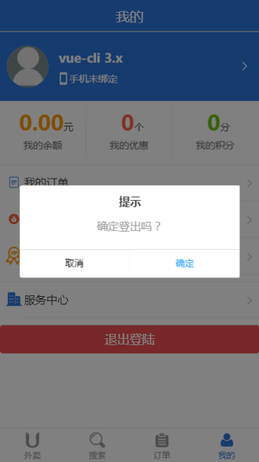

# takeaway_app
## 1. 基于 vue-cli3 开发的移动端项目；
## 2. 对应的后端服务器地址：
###   https://github.com/icedesert/takeaway_server
## 3. 启动前请务必确保已启动后台服务器；








## Project setup
```
npm install
```

### Compiles and hot-reloads for development
```
npm run serve
```

### Compiles and minifies for production
```
npm run build
```

### Run your tests
```
npm run test
```

### Lints and fixes files
```
npm run lint
```
### Customize configuration
See [Configuration Reference](https://cli.vuejs.org/config/).
